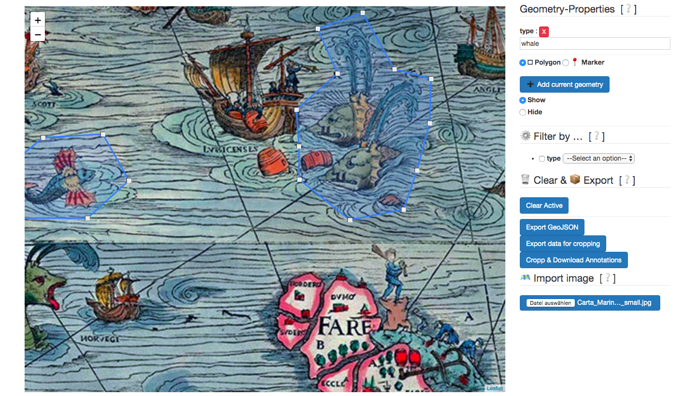
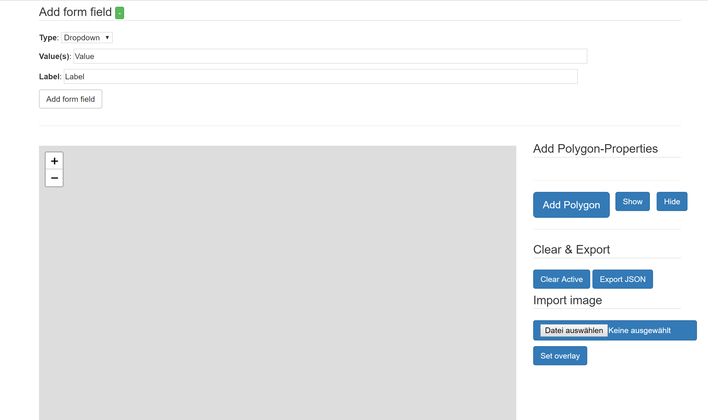
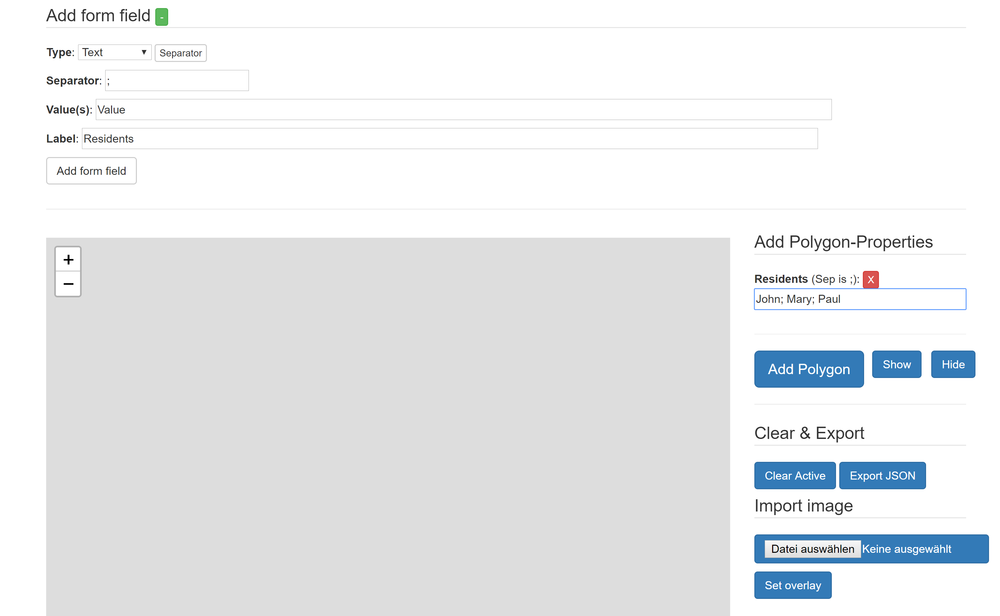
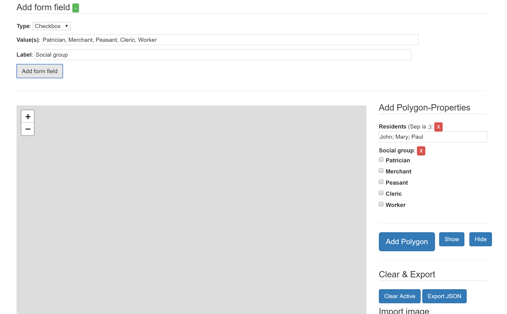
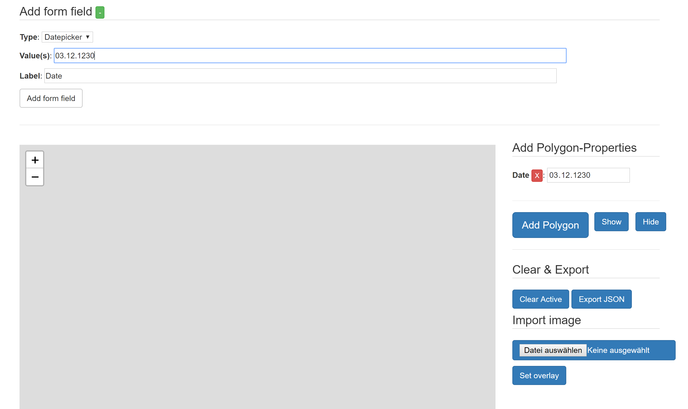
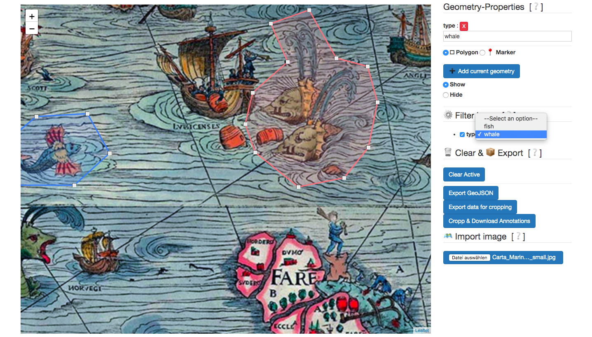
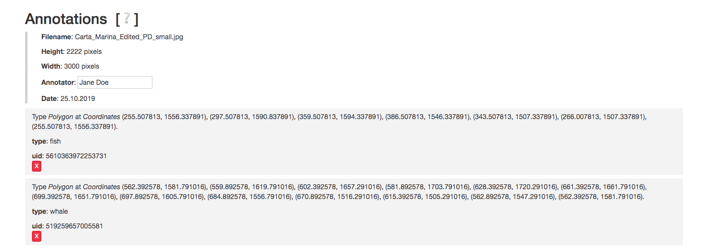

# animexgeo


<!-- TOC START min:1 max:3 link:true asterisk:false update:true -->
- [animexgeo](#animexgeo)
  - [Annotate Images and export GeoJSON](#annotate-images-and-export-geojson)
  - [Usage](#usage)
    - [Adding form fields](#adding-form-fields)
  - [GeoJSON Export](#geojson-export)
  - [Automatic Cropping of the Annotated Geometries with Canvas](#automatic-cropping-of-the-annotated-geometries-with-canvas)
  - [Automatic Cropping of the Annotated Geometries with Pillow](#automatic-cropping-of-the-annotated-geometries-with-pillow)
  - [Highlighting based on Metadata](#highlighting-based-on-metadata)
  - [Global Metadata & Annotations](#global-metadata--annotations)
- [To Do](#to-do)
- [License](#license)
<!-- TOC END -->


## Annotate Images and export GeoJSON
The script allows you …
* … to load images (jpg or png) into an [Leaflet.js](https://leafletjs.com/) canvas area via file dialog
* … to annotate areas with polygons (more options coming, see To Do below)
* … to configure a series of form fields and add them to the interface. The forms give you the opportunity to input various forms of metadata associated with the currently active polygon
* … to export the polygons and their corresponding metadata as a geojson file (the metadata are saved as `geojson.properties`).
* … to export a JSON file containing the data needed to slice or crop the polygons from the original image with the Pillow library. See [Automatic Cropping of the Annotated Geometries](#automatic-cropping-of-the-annotated-geometries) below.
* to export the cropped polygons as PNG files and the associated metadata as JSON files in one ZIP file. The ZIP file contains two folders:  
    * `images` contains the cropped polygons as PNG files.
    * `metadata` contains the corresponding metadata as JSON files.
* to highlight polygons based on the annotated metadata.

A live example may be found [here](https://hou2zi0.github.io/animexgeo/HTML/animexgeo.html).


## Usage

* Load a file via the file dialog.
* Add a form field to input metadata.
* Click on the loaded image to annotate with a polygon.
* Press the _enter key_ or click _Add polygon_ to add the polygon and its metadata to the underlying array of GeoJSON objects.
    * The edges of the polygons are now adjustable via drag and drop.
* Press _backspace_ or click _Clear Active_ to erase the currently active polygon from the canvas.
    * Right clicking on a polygon erases it and its annotations.
* Repeat the above.
* Click ‘Export JSON’ to retrieve the array of GeoJSON objects.

A live example may be found [here](https://hou2zi0.github.io/animexgeo/HTML/animexgeo.html).




### Adding form fields

The add form field section provides a way to add the following form fields to the interface:

* text
  * may take a property `separator` whose value, e.g. `,`, provides the separator on which the text will be exploded into an array
* textarea
* dropdown
  * the property `value(s)` expects a comma separated list providing the selectable items, e.g. `cat, dog, bunny`
* checkbox
  * the property `value(s)` expects a comma separated list providing the selectable items, e.g. `cat, dog, bunny`
* date



#### Text with separator char



#### Checkbox



#### Date picker



<!--
### Configuration array

The example configuration provided in the live example is based on the following list of JSON objects. The script currently works with the following types of input:
* text
  * may take a property `"separator"` whose value `","` gives the separator on which the text will be exploded into an array
* textarea
* dropdown
  * the property `value` expects a comma separated list providing the selectable items, e.g. `"value": "cat, dog, bunny"`
* checkbox
  * the property `value` expects a comma separated list providing the selectable items, e.g. `"value": "cat, dog, bunny"`
* date
  * you may provide the optional properties `min` and `max`

Example config:
* `type` sets the form fields type (see above)
* `value` sets either a default value, e.g. for `text`, or provides the different seletcion options, e.g. for `checkbox`
* `hmtlId` provides the html elements id, which is used by the script to acquire input values
* `propertyId` provides a property key, which will be used in the `geojson.properties`
* `label` provides a label for the input form field

#### Example configuration array
```javascript
const POLY_METADATA = [{
    "type": "text",
    "value": "Name",
    "htmlId": "name",
    "propertyId": "namestring",
    "label": "Name or ID"
  },
  {
    "type": "text",
    "value": "Cataloguenumbers",
    "htmlId": "cats",
    "propertyId": "cataloguenumbers",
    "label": "Calatoguenumbers (comma separated)",
    "separator": ","
  },
  {
    "type": "textarea",
    "value": "Commentary",
    "htmlId": "comment",
    "propertyId": "commentary",
    "label": "Commentary"
  },
  {
    "type": "dropdown",
    "value": "Value 1, Value 2, Value 3",
    "htmlId": "select",
    "propertyId": "selection",
    "label": "Selection"
  },
  {
    "type": "checkbox",
    "value": "Value 1, Value 2, Value 3",
    "htmlId": "check",
    "propertyId": "checked",
    "label": "Checkbox"
  },
  {
    "type": "date",
    "value": "1500-01-01",
    "htmlId": "date-begin",
    "propertyId": "post quem",
    "label": "Dating (post quem)",
    "min": "0500-01-01", // optional
    "max": "1675-12-31" // optional
  }
]
```
-->


## GeoJSON Export

A sample GeoJSON export is shown below.

```javascript
[{
    "type": "Feature",
    "properties": {
        "namestring": "M2",
        "cataloguenumbers": ["213"],
        "commentary": "Meisterzeichen des Meisters \u2026",
        "selection": "Value 2",
        "checked": [
            "Value 1",
            "Value 3"
        ],
        "post quem": "1500-01-01"
    },
    "geometry": {
        "type": "Polygon",
        "coordinates": [
            [
                [
                    674.734888,
                    2356.000046
                ],
                [
                    1026.527193,
                    2356.000046
                ],
                [
                    1018.531913,
                    2016.000072
                ],
                [
                    1018.531913,
                    2016.000072
                ],
                [
                    681.465391,
                    2016.000036
                ],
                [
                    674.734888,
                    2356.000046
                ]
            ],
            [
                [
                    0,
                    0
                ],
                [
                    0,
                    0
                ]
            ]
        ]
    }
}]
```
## Automatic Cropping of the Annotated Geometries with Canvas

The button _Crop & Download Annotations_ downloads a ZIP file containing the cutout polygons as PNG file and the corresponding metadata as JSON files.

The PNGs are stored in the `images` folder, the metadata file are stored in the `metadata` folder.

```shell
~/Downloads/Download
 λ >>> ls images metadata
images:
519259657005581_cropped_from_Carta_Marina_Edited_PD_small.jpg.png
5610363972253731_cropped_from_Carta_Marina_Edited_PD_small.jpg.png

metadata:
519259657005581.metadata.json  5610363972253731.metadata.json
```

**Important**: For security reasons your browser may prompt you if you want to keep the downloaded ZIP file.


## Automatic Cropping of the Annotated Geometries with Pillow

You may download the annotation data in a JSON-file preprocessed in order to facilitate cropping with the `Pillow`-library used for image processing in `Python`. The JSON-file looks like this:

```JSON
{
    "image": {
        "height": "200",
        "width": "200",
        "filename": "avatar.png"
    },
    "croppData": [
        {
            "boundaries": {
                "x": 67.628702,
                "y": 63.75,
                "x_width": 102.624715,
                "y_height": 90.25
            },
            "properties": {"uid": "6639796374739386"}
        },
        {
            "boundaries": {
                "x": 104.374516,
                "y": 73,
                "x_width": 130.371555,
                "y_height": 99.75
            },
            "properties": {"uid": "7264638360757893"}
        },
        {
            "boundaries": {
                "x": 10.885166,
                "y": 124,
                "x_width": 70.62836,
                "y_height": 177.25
            },
            "properties": {"uid": "48324136981436183"}
        }
    ]
}
```
The `image`-field contains metadata about the annotated image to provide the necessary context. The `croppData`-field contains an array of JSON-objects which represent your geometries. The `properties`-field contains your annotations, the `boundaries`-field contains the pixel coordinates, calculated from the coordinates used in `Leaflet`, needed to crop the geometries from the image.

The geometries may be cropped automatically as follows:

```Python
from PIL import Image
import json
with open('/Users/houzi/Downloads/avatar.png.cropping.json', 'r') as jsonFile:
  jsonData = json.loads(jsonFile.read())
imageFolder = '/Users/houzi/Pictures/'
image = Image.open(imageFolder + jsonData['image']['filename'])
for object in jsonData['croppData']:
  cropped = image.crop((
    object['boundaries']['x'],
    object['boundaries']['y'],
    object['boundaries']['x_width'],
    object['boundaries']['y_height']
  ))
  cropped.save(object['properties']['uid'] + '.png')
```

## Highlighting based on Metadata

A dropdown allows to highlight specific polygons based on the previously givven metadata.



## Global Metadata & Annotations

Global image metadata and your metadata annotations are given below the the canvas at the foot of the site.



# To Do

* Provide point and multi polygon annotation.
* Bundle into Electron application.
* Bundle into Atom plugin.
* Refactor to make code more maintainable.
* Provide better `geojson.properties` preview in popup.

# License

The software is published under the terms of the MIT license.

Copyright 2018–2019 Max Grüntgens (猴子)

Permission is hereby granted, free of charge, to any person obtaining a copy of this software and associated documentation files (the "Software"), to deal in the Software without restriction, including without limitation the rights to use, copy, modify, merge, publish, distribute, sublicense, and/or sell copies of the Software, and to permit persons to whom the Software is furnished to do so, subject to the following conditions:

The above copyright notice and this permission notice shall be included in all copies or substantial portions of the Software.

THE SOFTWARE IS PROVIDED “AS IS”, WITHOUT WARRANTY OF ANY KIND, EXPRESS OR IMPLIED, INCLUDING BUT NOT LIMITED TO THE WARRANTIES OF MERCHANTABILITY, FITNESS FOR A PARTICULAR PURPOSE AND NONINFRINGEMENT. IN NO EVENT SHALL THE AUTHORS OR COPYRIGHT HOLDERS BE LIABLE FOR ANY CLAIM, DAMAGES OR OTHER LIABILITY, WHETHER IN AN ACTION OF CONTRACT, TORT OR OTHERWISE, ARISING FROM, OUT OF OR IN CONNECTION WITH THE SOFTWARE OR THE USE OR OTHER DEALINGS IN THE SOFTWARE.
