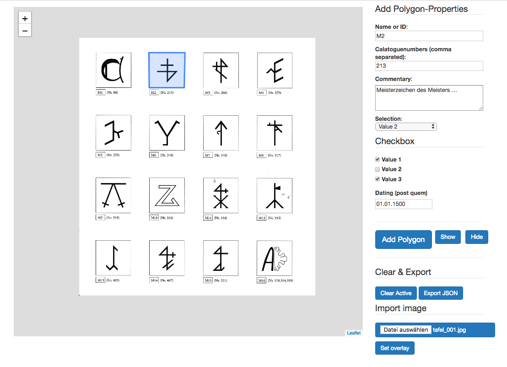

# animexgeo

<!-- TOC START min:1 max:3 link:true update:true -->
- [animexgeo](#animexgeo)
  - [Annotate Images and export GeoJSON](#annotate-images-and-export-geojson)
  - [Usage](#usage)
    - [Configuration array](#configuration-array)
    - [HTML Scaffold](#html-scaffold)
    - [GeoJSON Export](#geojson-export)
- [To Do](#to-do)
- [License](#license)

<!-- TOC END -->


## Annotate Images and export GeoJSON
The script allows you
* to load images (jpg or png) into an [Leaflet.js](https://leafletjs.com/) canvas area via file dialog
* to annotate areas with polygons (more options coming, see To Do below)
  * the polygon may contain one hole, which can be annotated by holding the shift key while clicking
* to provide a configuration file, which will render as a series of form fields, which give you the opportunity to input various forms of metadata associated with the currently active polygon
* export the polygons and their corresponding metadata as a geojson file (the metadata are saved as `geojson.properties`).

A live example may be found [here](https://hou2zi0.github.io/animexgeo/HTML/animexgeo.html).


## Usage

On a local machine:
* Start a local server, e.g. via `python -m SimpleHTTPServer`, and load your HTML file.

Then:
* Load a file via the file dialog and click ‘Set overlay’ to adjust the image size to the canvas.
* Click on the loaded image to annotate the polygon.
* Fill in the form fields to provide metadata.
* Click ‘Add polygon’ to add the polygon and its metadata to the underlying array of GeoJSON objects.
* Click ‘Clear Active’ to erase the currently active polygon from the canvas.
  * ‘Show’ shows all currently annotated polygons, ‘Hide’ hides all currently annotated polygons.
* Repeat the above.
* Click ‘Export JSON’ to retrieve the array of GeoJSON objects.

A live example may be found [here](https://hou2zi0.github.io/animexgeo/HTML/animexgeo.html).



### Configuration array

The example configuration provided in the live example is based on the following list of JSON objects. The script currently works with the following types of input:
* text
  * may take a property `"separator"` whose value `","` gives the separator on which the text will be exploded into an array
* textarea
* dropdown
  * the property `value` expects a comma separated list providing the selectable items, e.g. `"value": "cat, dog, bunny"`
* checkbox
  * the property `value` expects a comma separated list providing the selectable items, e.g. `"value": "cat, dog, bunny"`
* date
  * you may provide the optional properties `min` and `max`

Example config:
* `type` sets the form fields type (see above)
* `value` sets either a default value, e.g. for `text`, or provides the different seletcion options, e.g. for `checkbox`
* `hmtlId` provides the html elements id, which is used by the script to acquire input values
* `propertyId` provides a property key, which will be used in the `geojson.properties`
* `label` provides a label for the input form field

#### Example configuration array
```javascript
const POLY_METADATA = [{
    "type": "text",
    "value": "Name",
    "htmlId": "name",
    "propertyId": "namestring",
    "label": "Name or ID"
  },
  {
    "type": "text",
    "value": "Cataloguenumbers",
    "htmlId": "cats",
    "propertyId": "cataloguenumbers",
    "label": "Calatoguenumbers (comma separated)",
    "separator": ","
  },
  {
    "type": "textarea",
    "value": "Commentary",
    "htmlId": "comment",
    "propertyId": "commentary",
    "label": "Commentary"
  },
  {
    "type": "dropdown",
    "value": "Value 1, Value 2, Value 3",
    "htmlId": "select",
    "propertyId": "selection",
    "label": "Selection"
  },
  {
    "type": "checkbox",
    "value": "Value 1, Value 2, Value 3",
    "htmlId": "check",
    "propertyId": "checked",
    "label": "Checkbox"
  },
  {
    "type": "date",
    "value": "1500-01-01",
    "htmlId": "date-begin",
    "propertyId": "post quem",
    "label": "Dating (post quem)",
    "min": "0500-01-01", // optional
    "max": "1675-12-31" // optional
  }
]
```

### HTML Scaffold

The example uses [Bootstrap CSS](https://getbootstrap.com/docs/3.3/css/).

All the fieldsets, buttons, and their corresponding IDs are required for the script to retrieve values and to set event listeners. The sequence of these elements may be changed at will.

```html
<html>

<head>
  <title>Annotate images &amp; export GeoJSON</title>
  <link rel="stylesheet" href="https://maxcdn.bootstrapcdn.com/bootstrap/3.3.7/css/bootstrap.min.css" integrity="sha384-BVYiiSIFeK1dGmJRAkycuHAHRg32OmUcww7on3RYdg4Va+PmSTsz/K68vbdEjh4u" crossorigin="anonymous" />
  <style>
    fieldset {
      margin-top: 5px;
    }

    div#mapid {
      margin-top: 15px;
      margin-bottom: 15px;
    }
  </style>
</head>

<body>
  <div class="container">
    <div class="row">
      <div class="col-lg-9">
        <div id="mapid"></div>
      </div>
      <div class="col-lg-3">
        <fieldset id="poly-data">
          <legend>
            Add Polygon-Properties
          </legend>
        </fieldset>
        <hr />
        <div class="row" id="poly-data-button">
          <div class="col-lg-6">
            <button id="poly-add" class="btn btn-lg btn-primary">Add Polygon</button>
          </div>
          <div class="col-lg-3">
            <button id="poly-show" class="btn  btn-primary">Show</button>
          </div>
          <div class="col-lg-3">
            <button id="poly-hide" class="btn  btn-primary">Hide</button>
          </div>
        </div>
        <hr />
        <fieldset>
          <legend>
            Clear &amp; Export
          </legend>
          <button id="poly-clear" class="btn btn-primary">Clear Active</button>
          <button id="poly-export" class="btn btn-primary">Export JSON</button>
        </fieldset>
        <fieldset>
          <legend>
            Import image
          </legend>
          <input type="file" id="poly-file" accept="image/png, image/jpeg" class="btn btn-primary" style="margin-bottom: 10px;" />
          <button id="poly-overlay" class="btn btn-primary">Set overlay</button>
        </fieldset>
      </div>
    </div>
  </div>
  <script>
    const POLY_METADATA = [{
        "type": "text",
        "value": "Name",
        "htmlId": "name",
        "propertyId": "namestring",
        "label": "Name oder ID"
      },
      {
        "type": "text",
        "value": "Katalognummern",
        "htmlId": "cats",
        "propertyId": "cataloguenumber",
        "label": "Katalognummern (kommasepariert)",
        "separator": ","
      },
      {
        "type": "textarea",
        "value": "Kommentar",
        "htmlId": "comment",
        "propertyId": "commentary",
        "label": "Kommentar"
      },
      {
        "type": "dropdown",
        "value": "Value 1, Value 2, Value 3",
        "htmlId": "select",
        "propertyId": "selection",
        "label": "Selektion"
      },
      {
        "type": "checkbox",
        "value": "Value 1, Value 2, Value 3",
        "htmlId": "check",
        "propertyId": "checked",
        "label": "Checkbox"
      },
      {
        "type": "date",
        "value": "1500-01-01",
        "htmlId": "date-begin",
        "propertyId": "post quem",
        "label": "Datierung (Anfang)",
        "min": "0500-01-01", // optional
        "max": "1675-12-31" // optional
      }
    ]
  </script>
  <script src="https://hou2zi0.github.io/animexgeo/JS/animexgeo.js">
  </script>
</body>

</html>
```
### GeoJSON Export

A sample GeoJSON export is shown below.

```javascript
[{
    "type": "Feature",
    "properties": {
        "namestring": "M2",
        "cataloguenumbers": ["213"],
        "commentary": "Meisterzeichen des Meisters \u2026",
        "selection": "Value 2",
        "checked": [
            "Value 1",
            "Value 3"
        ],
        "post quem": "1500-01-01"
    },
    "geometry": {
        "type": "Polygon",
        "coordinates": [
            [
                [
                    674.734888,
                    2356.000046
                ],
                [
                    1026.527193,
                    2356.000046
                ],
                [
                    1018.531913,
                    2016.000072
                ],
                [
                    1018.531913,
                    2016.000072
                ],
                [
                    681.465391,
                    2016.000036
                ],
                [
                    674.734888,
                    2356.000046
                ]
            ],
            [
                [
                    0,
                    0
                ],
                [
                    0,
                    0
                ]
            ]
        ]
    }
}]
```


# To Do

* Provide point and multi polygon annotation.
* Allow adjustment of polygon edges via mouse click and drag.
* Bundle into Electron application.
* Bundle into Atom plugin.
* Refactor to make code more maintainable.
* Provide better `geojson.properties` preview in popup.

# License

The software is published under the terms of the MIT license.

Copyright 2018 Max Grüntgens

Permission is hereby granted, free of charge, to any person obtaining a copy of this software and associated documentation files (the "Software"), to deal in the Software without restriction, including without limitation the rights to use, copy, modify, merge, publish, distribute, sublicense, and/or sell copies of the Software, and to permit persons to whom the Software is furnished to do so, subject to the following conditions:

The above copyright notice and this permission notice shall be included in all copies or substantial portions of the Software.

THE SOFTWARE IS PROVIDED “AS IS”, WITHOUT WARRANTY OF ANY KIND, EXPRESS OR IMPLIED, INCLUDING BUT NOT LIMITED TO THE WARRANTIES OF MERCHANTABILITY, FITNESS FOR A PARTICULAR PURPOSE AND NONINFRINGEMENT. IN NO EVENT SHALL THE AUTHORS OR COPYRIGHT HOLDERS BE LIABLE FOR ANY CLAIM, DAMAGES OR OTHER LIABILITY, WHETHER IN AN ACTION OF CONTRACT, TORT OR OTHERWISE, ARISING FROM, OUT OF OR IN CONNECTION WITH THE SOFTWARE OR THE USE OR OTHER DEALINGS IN THE SOFTWARE.
